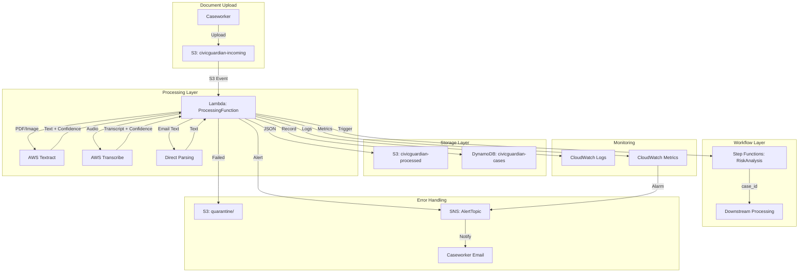
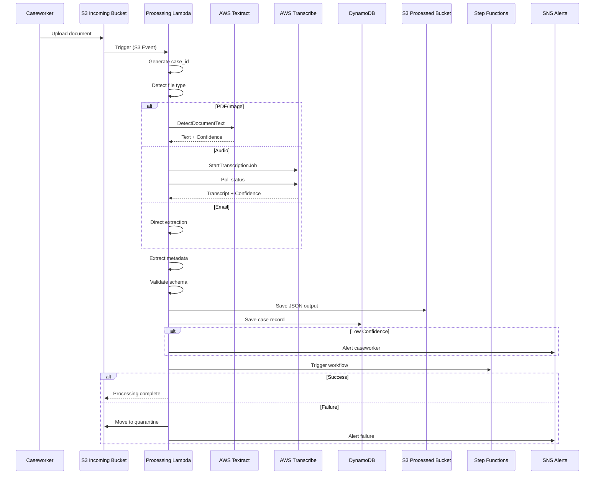
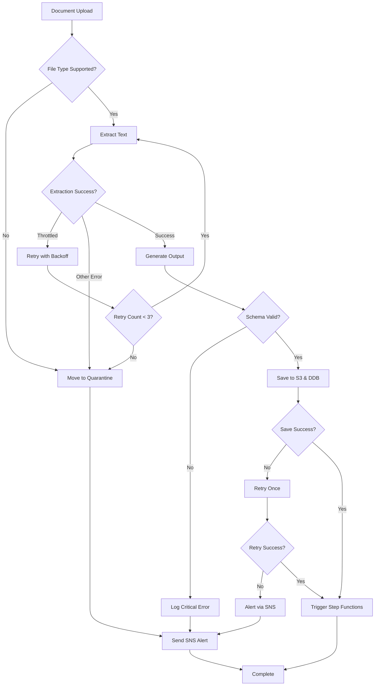
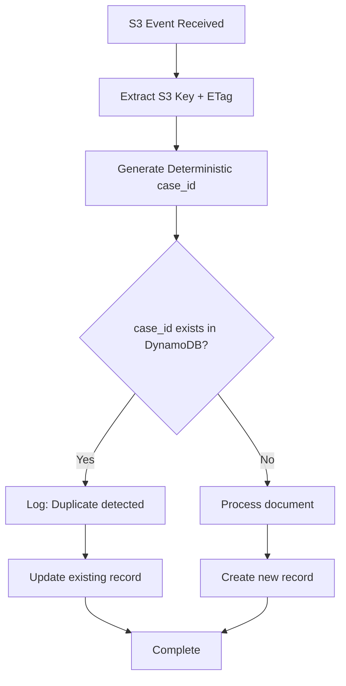

# Design Document: Document Ingestion Pipeline

## Overview

The Document Ingestion Pipeline is a serverless, event-driven system built on AWS that automatically processes correspondence for vulnerable adults. The system receives documents through S3 uploads, extracts text using AWS AI services (Textract for documents, Transcribe for audio), and stores structured data for downstream risk analysis.

### Key Design Principles

1. **Serverless Architecture**: Eliminates infrastructure management and scales automatically
2. **Event-Driven Processing**: S3 events trigger Lambda functions for immediate processing
3. **Cost Optimization**: Designed to operate within AWS Free Tier limits ($5/month target)
4. **Security First**: Encryption at rest and in transit, PII protection in logs, least privilege IAM
5. **Resilience**: Exponential backoff retries, quarantine for failed documents, comprehensive alerting
6. **Observability**: CloudWatch metrics and logs for monitoring, usage tracking for cost control

### System Boundaries

**In Scope:**
- Document upload handling (S3 events)
- File type detection and routing
- Text extraction (Textract, Transcribe, direct parsing)
- Metadata extraction and sender detection
- Structured JSON output generation
- DynamoDB record creation
- Step Functions workflow triggering
- Error handling and quarantine
- Cost monitoring and alerting

**Out of Scope:**
- Document upload UI (handled by separate system)
- Risk analysis and scoring (downstream Step Functions workflow)
- Caseworker dashboard (separate application)
- Long-term document retention beyond 7 years
- Multi-language support beyond en-GB

## Architecture

### High-Level Architecture Diagram



### Component Architecture


#### 1. S3 Buckets

**civicguardian-incoming**
- Purpose: Receives uploaded documents
- Encryption: SSE-S3 (AES-256)
- Versioning: Enabled
- Event Notifications: Configured to trigger Lambda on object creation
- Lifecycle Policy:
  - Transition to Glacier after 90 days
  - Delete after 7 years (2,555 days)
- Quarantine Prefix: `quarantine/` for failed documents

**civicguardian-processed**
- Purpose: Stores extracted JSON outputs
- Encryption: SSE-S3 (AES-256)
- Versioning: Enabled (for audit trail)
- Lifecycle Policy:
  - Transition to Glacier after 90 days
  - Delete after 7 years (2,555 days)

#### 2. Lambda Function: ProcessingFunction

**Configuration:**
- Runtime: Python 3.11
- Memory: 512 MB
- Timeout: 30 seconds
- Reserved Concurrency: 10 (cost control)
- Environment Variables:
  - `PROCESSED_BUCKET`: civicguardian-processed
  - `CASE_TABLE`: civicguardian-cases
  - `STEP_FUNCTIONS_ARN`: arn:aws:states:region:account:stateMachine:RiskAnalysis
  - `SNS_TOPIC_ARN`: arn:aws:sns:region:account:AlertTopic
  - `TEXTRACT_PAGE_LIMIT`: 900
  - `TRANSCRIBE_MINUTE_LIMIT`: 55

**Trigger:**
- S3 Event: `s3:ObjectCreated:*` on civicguardian-incoming bucket

**IAM Role Permissions (Least Privilege):**
```json
{
  "Version": "2012-10-17",
  "Statement": [
    {
      "Effect": "Allow",
      "Action": [
        "s3:GetObject",
        "s3:GetObjectVersion"
      ],
      "Resource": "arn:aws:s3:::civicguardian-incoming/*"
    },
    {
      "Effect": "Allow",
      "Action": [
        "s3:PutObject"
      ],
      "Resource": [
        "arn:aws:s3:::civicguardian-processed/*",
        "arn:aws:s3:::civicguardian-incoming/quarantine/*"
      ]
    },
    {
      "Effect": "Allow",
      "Action": [
        "textract:DetectDocumentText"
      ],
      "Resource": "*"
    },
    {
      "Effect": "Allow",
      "Action": [
        "transcribe:StartTranscriptionJob",
        "transcribe:GetTranscriptionJob"
      ],
      "Resource": "*"
    },
    {
      "Effect": "Allow",
      "Action": [
        "dynamodb:PutItem",
        "dynamodb:UpdateItem"
      ],
      "Resource": "arn:aws:dynamodb:region:account:table/civicguardian-cases"
    },
    {
      "Effect": "Allow",
      "Action": [
        "states:StartExecution"
      ],
      "Resource": "arn:aws:states:region:account:stateMachine:RiskAnalysis"
    },
    {
      "Effect": "Allow",
      "Action": [
        "sns:Publish"
      ],
      "Resource": "arn:aws:sns:region:account:AlertTopic"
    },
    {
      "Effect": "Allow",
      "Action": [
        "logs:CreateLogGroup",
        "logs:CreateLogStream",
        "logs:PutLogEvents"
      ],
      "Resource": "arn:aws:logs:region:account:log-group:/aws/lambda/ProcessingFunction:*"
    },
    {
      "Effect": "Allow",
      "Action": [
        "cloudwatch:PutMetricData"
      ],
      "Resource": "*",
      "Condition": {
        "StringEquals": {
          "cloudwatch:namespace": "CivicGuardian/Ingestion"
        }
      }
    }
  ]
}
```

#### 3. DynamoDB Table: civicguardian-cases

**Schema:**
- Partition Key: `case_id` (String, UUID)
- Attributes:
  - `case_id`: String (UUID)
  - `timestamp`: Number (Unix timestamp)
  - `document_s3_key`: String
  - `extracted_text`: String
  - `sender`: String (nullable)
  - `document_type`: String (letter|email|voicemail)
  - `confidence`: Number (0.0-1.0)
  - `page_count`: Number
  - `language`: String (default: en-GB)
  - `status`: String (processed|quarantined)
  - `created_at`: String (ISO 8601)
  - `low_confidence`: Boolean
  - `manual_review_required`: Boolean (optional)
  - `error_message`: String (optional, for quarantined items)

**Configuration:**
- Billing Mode: On-Demand (cost-effective for low volume)
- Encryption: AWS managed key
- Point-in-Time Recovery: Enabled
- TTL: Not configured (7-year retention via S3 lifecycle)

#### 4. SNS Topic: AlertTopic

**Purpose:** Sends alerts for failures, low confidence documents, and usage limits

**Subscriptions:**
- Email: caseworker-alerts@example.com
- (Optional) SMS for critical alerts

**Message Types:**
1. Document quarantined (failure after retries)
2. Low confidence extraction (< 0.5)
3. Usage limit warnings (Textract > 900 pages, Transcribe > 55 minutes)
4. DynamoDB write failures
5. Step Functions trigger failures
6. Schema validation failures

#### 5. Step Functions State Machine: RiskAnalysis

**Purpose:** Downstream workflow for risk scoring and analysis (out of scope for this design)

**Input from Ingestion Pipeline:**
```json
{
  "case_id": "uuid-string"
}
```

**Trigger:** Invoked by ProcessingFunction after successful document processing

#### 6. CloudWatch Components

**Log Groups:**
- `/aws/lambda/ProcessingFunction`: Lambda execution logs
- Log Retention: 30 days (cost optimization)

**Metrics (Custom Namespace: CivicGuardian/Ingestion):**
- `DocumentsProcessed`: Count of successfully processed documents
- `DocumentsQuarantined`: Count of failed documents
- `AverageConfidenceScore`: Average OCR/transcription confidence
- `TextractPagesUsed`: Monthly page count for Textract
- `TranscribeMinutesUsed`: Monthly minutes for Transcribe
- `ProcessingDuration`: Average processing time in milliseconds

**Alarms:**
1. `TextractUsageAlarm`: Triggers at 900 pages/month
2. `TranscribeUsageAlarm`: Triggers at 55 minutes/month
3. `HighQuarantineRate`: Triggers if quarantine rate > 10%
4. `LambdaErrors`: Triggers on Lambda function errors

## Components and Interfaces

### Lambda Function Structure

The ProcessingFunction is organized into modular components for maintainability and testability.

#### Module Structure

```
processing_function/
├── lambda_handler.py          # Entry point, event handling
├── file_detector.py           # File type detection
├── text_extractors/
│   ├── textract_extractor.py  # PDF/image processing
│   ├── transcribe_extractor.py # Audio processing
│   └── email_extractor.py     # Direct text extraction
├── metadata_extractor.py      # Sender detection, classification
├── output_generator.py        # JSON schema generation
├── storage_manager.py         # S3 and DynamoDB operations
├── retry_handler.py           # Exponential backoff logic
├── monitoring.py              # CloudWatch metrics and logging
└── config.py                  # Configuration and constants
```

#### Pseudocode: lambda_handler.py

```python
import json
import time
from datetime import datetime
from file_detector import detect_file_type
from text_extractors import textract_extractor, transcribe_extractor, email_extractor
from metadata_extractor import extract_metadata
from output_generator import generate_output_json, validate_schema
from storage_manager import save_to_s3, save_to_dynamodb, move_to_quarantine
from monitoring import log_processing_start, log_processing_complete, emit_metrics
from config import Config

def lambda_handler(event, context):
    """
    Main entry point for document processing Lambda function.
    Triggered by S3 ObjectCreated events.
    """
    start_time = time.time()
    
    # Check if approaching timeout (28 seconds)
    remaining_time = context.get_remaining_time_in_millis() / 1000
    if remaining_time < 3:
        log_warning("Lambda starting with insufficient time remaining")
        return {"statusCode": 500, "body": "Insufficient time to process"}
    
    try:
        # Parse S3 event
        s3_event = event['Records'][0]['s3']
        bucket_name = s3_event['bucket']['name']
        object_key = s3_event['object']['key']
        file_size = s3_event['object']['size']
        upload_timestamp = s3_event['object']['eTag']  # For idempotency
        
        # Generate deterministic case_id for idempotency
        case_id = generate_case_id(object_key, upload_timestamp)
        
        # Log processing start (no PII)
        log_processing_start(case_id, file_size)
        
        # Detect file type
        file_type, file_extension = detect_file_type(object_key)
        
        # Route to appropriate extractor
        if file_type == "unsupported":
            handle_unsupported_file(bucket_name, object_key, case_id)
            return {"statusCode": 400, "body": "Unsupported file type"}
        
        # Extract text based on file type
        extraction_result = extract_text(
            bucket_name, object_key, file_type, file_extension, context
        )
        
        if extraction_result["status"] == "failed":
            handle_extraction_failure(
                bucket_name, object_key, case_id, extraction_result["error"]
            )
            return {"statusCode": 500, "body": "Extraction failed"}
        
        # Extract metadata
        metadata = extract_metadata(
            extraction_result["text"], file_type, extraction_result
        )
        
        # Generate output JSON
        output_json = generate_output_json(
            case_id=case_id,
            document_s3_key=f"s3://{bucket_name}/{object_key}",
            extracted_text=extraction_result["text"],
            metadata=metadata,
            status="processed"
        )
        
        # Validate schema
        if not validate_schema(output_json):
            handle_schema_validation_failure(case_id)
            return {"statusCode": 500, "body": "Schema validation failed"}
        
        # Save to S3 processed bucket
        save_to_s3(
            bucket=Config.PROCESSED_BUCKET,
            key=f"{case_id}.json",
            data=output_json
        )
        
        # Save to DynamoDB with retry
        save_to_dynamodb(output_json, retry=True)
        
        # Check for low confidence
        if metadata["confidence"] < 0.5:
            handle_low_confidence(case_id, metadata["confidence"])
        
        # Trigger Step Functions
        trigger_step_functions(case_id)
        
        # Log completion and emit metrics
        processing_duration = (time.time() - start_time) * 1000
        log_processing_complete(case_id, processing_duration, metadata["confidence"])
        emit_metrics(extraction_result, metadata)
        
        return {
            "statusCode": 200,
            "body": json.dumps({"case_id": case_id, "status": "processed"})
        }
        
    except Exception as e:
        # Log error without PII
        log_error(case_id if 'case_id' in locals() else "unknown", str(e))
        send_sns_alert(f"Unexpected error: {type(e).__name__}")
        return {"statusCode": 500, "body": "Internal error"}


def extract_text(bucket, key, file_type, extension, context):
    """
    Routes document to appropriate text extraction service.
    Returns: dict with status, text, confidence, page_count
    """
    remaining_time = context.get_remaining_time_in_millis() / 1000
    
    if file_type == "pdf" or file_type == "image":
        return textract_extractor.extract(bucket, key, remaining_time)
    
    elif file_type == "audio":
        return transcribe_extractor.extract(bucket, key, remaining_time)
    
    elif file_type == "email":
        return email_extractor.extract(bucket, key, extension)
    
    else:
        return {"status": "failed", "error": "Unknown file type"}


def generate_case_id(object_key, upload_timestamp):
    """
    Generates deterministic UUID from S3 key and timestamp for idempotency.
    """
    import hashlib
    import uuid
    
    # Create deterministic hash
    hash_input = f"{object_key}:{upload_timestamp}".encode('utf-8')
    hash_digest = hashlib.sha256(hash_input).hexdigest()
    
    # Convert to UUID format
    return str(uuid.UUID(hash_digest[:32]))


def handle_unsupported_file(bucket, key, case_id):
    """Moves unsupported files to quarantine and alerts."""
    move_to_quarantine(bucket, key, "Unsupported file type")
    send_sns_alert(f"Unsupported file quarantined: {case_id}")
    save_quarantine_record(case_id, key, "Unsupported file type")


def handle_extraction_failure(bucket, key, case_id, error):
    """Handles extraction failures after all retries exhausted."""
    move_to_quarantine(bucket, key, error)
    send_sns_alert(f"Extraction failed: {case_id} - {error}")
    save_quarantine_record(case_id, key, error)


def handle_low_confidence(case_id, confidence):
    """Flags low confidence documents for manual review."""
    send_sns_alert(
        f"Low confidence document: {case_id} (confidence: {confidence:.2f})"
    )


def handle_schema_validation_failure(case_id):
    """Handles critical schema validation errors."""
    log_critical_error(case_id, "Schema validation failed")
    send_sns_alert(f"CRITICAL: Schema validation failed for {case_id}")


def trigger_step_functions(case_id):
    """Triggers downstream Step Functions workflow."""
    import boto3
    
    try:
        sfn_client = boto3.client('stepfunctions')
        sfn_client.start_execution(
            stateMachineArn=Config.STEP_FUNCTIONS_ARN,
            input=json.dumps({"case_id": case_id})
        )
    except Exception as e:
        log_error(case_id, f"Step Functions trigger failed: {str(e)}")
        send_sns_alert(f"Step Functions trigger failed: {case_id}")


def save_quarantine_record(case_id, s3_key, error_message):
    """Saves quarantine record to DynamoDB."""
    quarantine_record = {
        "case_id": case_id,
        "timestamp": int(time.time()),
        "document_s3_key": s3_key,
        "status": "quarantined",
        "error_message": error_message,
        "created_at": datetime.utcnow().isoformat() + "Z"
    }
    save_to_dynamodb(quarantine_record, retry=False)
```


#### Pseudocode: textract_extractor.py

```python
import boto3
import time
from retry_handler import exponential_backoff_retry
from monitoring import log_textract_usage

def extract(bucket, key, remaining_time):
    """
    Extracts text from PDF or image files using AWS Textract.
    
    Args:
        bucket: S3 bucket name
        key: S3 object key
        remaining_time: Seconds remaining in Lambda execution
    
    Returns:
        dict: {status, text, confidence, page_count, error}
    """
    textract_client = boto3.client('textract')
    
    # Check if we have enough time (need at least 5 seconds)
    if remaining_time < 5:
        return {
            "status": "failed",
            "error": "Insufficient time remaining for Textract"
        }
    
    # Define Textract API call with retry logic
    def textract_api_call():
        return textract_client.detect_document_text(
            Document={
                'S3Object': {
                    'Bucket': bucket,
                    'Name': key
                }
            }
        )
    
    try:
        # Call Textract with exponential backoff retry
        response = exponential_backoff_retry(
            api_call=textract_api_call,
            max_retries=3,
            initial_wait=1,
            service_name="Textract"
        )
        
        # Extract text from blocks
        extracted_text = ""
        confidence_scores = []
        page_count = 0
        
        for block in response['Blocks']:
            if block['BlockType'] == 'LINE':
                extracted_text += block['Text'] + "\n"
                confidence_scores.append(block['Confidence'])
            elif block['BlockType'] == 'PAGE':
                page_count += 1
        
        # Calculate average confidence
        avg_confidence = sum(confidence_scores) / len(confidence_scores) if confidence_scores else 0.0
        avg_confidence = avg_confidence / 100.0  # Convert to 0.0-1.0 scale
        
        # Log usage for monitoring
        log_textract_usage(page_count)
        
        return {
            "status": "success",
            "text": extracted_text.strip(),
            "confidence": round(avg_confidence, 3),
            "page_count": page_count
        }
        
    except Exception as e:
        return {
            "status": "failed",
            "error": f"Textract extraction failed: {type(e).__name__}"
        }
```

#### Pseudocode: transcribe_extractor.py

```python
import boto3
import time
import json
from retry_handler import exponential_backoff_retry
from monitoring import log_transcribe_usage

def extract(bucket, key, remaining_time):
    """
    Transcribes audio files using AWS Transcribe.
    
    Args:
        bucket: S3 bucket name
        key: S3 object key
        remaining_time: Seconds remaining in Lambda execution
    
    Returns:
        dict: {status, text, confidence, page_count, error}
    """
    transcribe_client = boto3.client('transcribe')
    s3_client = boto3.client('s3')
    
    # Check if we have enough time (need at least 10 seconds for polling)
    if remaining_time < 10:
        return {
            "status": "failed",
            "error": "Insufficient time remaining for Transcribe"
        }
    
    # Generate unique job name
    job_name = f"transcribe-{int(time.time())}-{key.replace('/', '-')}"
    media_uri = f"s3://{bucket}/{key}"
    
    # Start transcription job with retry
    def start_transcription():
        return transcribe_client.start_transcription_job(
            TranscriptionJobName=job_name,
            Media={'MediaFileUri': media_uri},
            MediaFormat=get_media_format(key),
            LanguageCode='en-GB'
        )
    
    try:
        # Start job with exponential backoff retry
        exponential_backoff_retry(
            api_call=start_transcription,
            max_retries=3,
            initial_wait=1,
            service_name="Transcribe"
        )
        
        # Poll for completion with timeout
        max_poll_time = min(25, remaining_time - 3)  # Reserve 3 seconds for cleanup
        start_poll = time.time()
        
        while (time.time() - start_poll) < max_poll_time:
            response = transcribe_client.get_transcription_job(
                TranscriptionJobName=job_name
            )
            
            status = response['TranscriptionJob']['TranscriptionJobStatus']
            
            if status == 'COMPLETED':
                # Get transcript from S3
                transcript_uri = response['TranscriptionJob']['Transcript']['TranscriptFileUri']
                transcript_data = fetch_transcript(transcript_uri)
                
                # Extract text and confidence
                text = transcript_data['results']['transcripts'][0]['transcript']
                
                # Calculate average confidence from items
                confidence_scores = []
                for item in transcript_data['results']['items']:
                    if 'confidence' in item:
                        confidence_scores.append(float(item['confidence']))
                
                avg_confidence = sum(confidence_scores) / len(confidence_scores) if confidence_scores else 0.0
                
                # Calculate duration for usage tracking
                duration_seconds = response['TranscriptionJob']['Media']['DurationSeconds']
                log_transcribe_usage(duration_seconds / 60.0)  # Convert to minutes
                
                return {
                    "status": "success",
                    "text": text,
                    "confidence": round(avg_confidence, 3),
                    "page_count": 1  # Audio files count as 1 page
                }
            
            elif status == 'FAILED':
                return {
                    "status": "failed",
                    "error": "Transcribe job failed"
                }
            
            # Wait before next poll
            time.sleep(2)
        
        # Timeout reached
        return {
            "status": "failed",
            "error": "Transcribe timeout after 25 seconds"
        }
        
    except Exception as e:
        return {
            "status": "failed",
            "error": f"Transcribe extraction failed: {type(e).__name__}"
        }


def get_media_format(key):
    """Determines media format from file extension."""
    extension = key.lower().split('.')[-1]
    format_map = {
        'mp3': 'mp3',
        'wav': 'wav',
        'm4a': 'mp4'
    }
    return format_map.get(extension, 'mp3')


def fetch_transcript(uri):
    """Fetches transcript JSON from S3 URI."""
    import requests
    response = requests.get(uri)
    return response.json()
```

#### Pseudocode: email_extractor.py

```python
import boto3
from html.parser import HTMLParser

def extract(bucket, key, extension):
    """
    Extracts text directly from email files (txt or html).
    
    Args:
        bucket: S3 bucket name
        key: S3 object key
        extension: File extension (txt or html)
    
    Returns:
        dict: {status, text, confidence, page_count}
    """
    s3_client = boto3.client('s3')
    
    try:
        # Download file content
        response = s3_client.get_object(Bucket=bucket, Key=key)
        content = response['Body'].read().decode('utf-8')
        
        # Process based on extension
        if extension == 'html':
            text = strip_html_tags(content)
        else:
            text = content
        
        return {
            "status": "success",
            "text": text.strip(),
            "confidence": 1.0,  # Direct extraction has perfect confidence
            "page_count": 1
        }
        
    except Exception as e:
        return {
            "status": "failed",
            "error": f"Email extraction failed: {type(e).__name__}"
        }


def strip_html_tags(html_content):
    """
    Strips HTML tags and returns plain text.
    """
    class HTMLTextExtractor(HTMLParser):
        def __init__(self):
            super().__init__()
            self.text = []
        
        def handle_data(self, data):
            self.text.append(data)
        
        def get_text(self):
            return ''.join(self.text)
    
    parser = HTMLTextExtractor()
    parser.feed(html_content)
    return parser.get_text()
```

#### Pseudocode: metadata_extractor.py

```python
import re
from datetime import datetime

def extract_metadata(text, file_type, extraction_result):
    """
    Extracts metadata including sender detection and document classification.
    
    Args:
        text: Extracted text content
        file_type: Type of file (pdf, image, audio, email)
        extraction_result: Result dict from text extraction
    
    Returns:
        dict: {sender, document_type, confidence, page_count, language}
    """
    return {
        "sender": detect_sender(text),
        "document_type": classify_document_type(file_type),
        "confidence": extraction_result.get("confidence", 1.0),
        "page_count": extraction_result.get("page_count", 1),
        "language": "en-GB"
    }


def detect_sender(text):
    """
    Detects sender organization from text using pattern matching.
    Returns first match or None.
    """
    # Known organization patterns (case-insensitive)
    patterns = [
        r'\bNHS\s+(?:Trust|Foundation|England)\b',
        r'\b(?:City|County|Borough|District)\s+Council\b',
        r'\bDepartment\s+for\s+Work\s+and\s+Pensions\b',
        r'\bDWP\b',
        r'\bHMRC\b',
        r'\bHer\s+Majesty\'?s\s+Revenue\s+and\s+Customs\b',
        r'\bSocial\s+Services\b',
        r'\bAdult\s+Social\s+Care\b'
    ]
    
    for pattern in patterns:
        match = re.search(pattern, text, re.IGNORECASE)
        if match:
            return match.group(0)
    
    return None


def classify_document_type(file_type):
    """
    Classifies document type based on file type.
    """
    type_map = {
        "pdf": "letter",
        "image": "letter",
        "audio": "voicemail",
        "email": "email"
    }
    return type_map.get(file_type, "letter")
```

#### Pseudocode: output_generator.py

```python
import json
from datetime import datetime
import time

def generate_output_json(case_id, document_s3_key, extracted_text, metadata, status):
    """
    Generates structured JSON output conforming to schema.
    
    Returns:
        dict: Complete output JSON
    """
    output = {
        "case_id": case_id,
        "timestamp": int(time.time()),
        "document_s3_key": document_s3_key,
        "extracted_text": extracted_text,
        "metadata": {
            "sender": metadata["sender"],
            "document_type": metadata["document_type"],
            "confidence": metadata["confidence"],
            "page_count": metadata["page_count"],
            "language": metadata["language"]
        },
        "status": status,
        "created_at": datetime.utcnow().isoformat() + "Z"
    }
    
    # Add low confidence flags if needed
    if metadata["confidence"] < 0.5:
        output["low_confidence"] = True
        output["manual_review_required"] = True
    
    return output


def validate_schema(output_json):
    """
    Validates that output JSON contains all required fields.
    
    Returns:
        bool: True if valid, False otherwise
    """
    required_fields = [
        "case_id", "timestamp", "document_s3_key", 
        "extracted_text", "metadata", "status", "created_at"
    ]
    
    required_metadata_fields = [
        "sender", "document_type", "confidence", 
        "page_count", "language"
    ]
    
    # Check top-level fields
    for field in required_fields:
        if field not in output_json:
            return False
    
    # Check metadata fields
    if "metadata" not in output_json:
        return False
    
    for field in required_metadata_fields:
        if field not in output_json["metadata"]:
            return False
    
    # Validate ISO 8601 timestamp format
    try:
        datetime.fromisoformat(output_json["created_at"].replace("Z", "+00:00"))
    except ValueError:
        return False
    
    return True
```

#### Pseudocode: retry_handler.py

```python
import time
import boto3

def exponential_backoff_retry(api_call, max_retries, initial_wait, service_name):
    """
    Executes API call with exponential backoff retry logic.
    
    Args:
        api_call: Callable function that makes the API call
        max_retries: Maximum number of retry attempts (3)
        initial_wait: Initial wait time in seconds (1)
        service_name: Name of service for logging (Textract/Transcribe)
    
    Returns:
        API response if successful
    
    Raises:
        Exception if all retries exhausted
    """
    wait_time = initial_wait
    
    for attempt in range(max_retries + 1):
        try:
            response = api_call()
            return response
            
        except boto3.exceptions.Boto3Error as e:
            error_code = e.response.get('Error', {}).get('Code', '')
            
            # Check if throttling error
            if error_code in ['ThrottlingException', 'ProvisionedThroughputExceededException']:
                if attempt < max_retries:
                    log_retry(service_name, attempt + 1, wait_time)
                    time.sleep(wait_time)
                    wait_time *= 2  # Exponential backoff: 1s, 2s, 4s
                else:
                    log_retry_exhausted(service_name, max_retries)
                    raise
            else:
                # Non-throttling error, don't retry
                raise
        
        except Exception as e:
            # Unexpected error, don't retry
            raise


def log_retry(service_name, attempt, wait_time):
    """Logs retry attempt (no PII)."""
    print(f"{service_name} throttled, retry {attempt} after {wait_time}s")


def log_retry_exhausted(service_name, max_retries):
    """Logs when retries are exhausted (no PII)."""
    print(f"{service_name} failed after {max_retries} retries")
```

#### Pseudocode: storage_manager.py

```python
import boto3
import json

def save_to_s3(bucket, key, data):
    """
    Saves JSON data to S3 with encryption.
    
    Args:
        bucket: Target S3 bucket
        key: Object key
        data: Dict to save as JSON
    """
    s3_client = boto3.client('s3')
    
    s3_client.put_object(
        Bucket=bucket,
        Key=key,
        Body=json.dumps(data, indent=2),
        ContentType='application/json',
        ServerSideEncryption='AES256'
    )


def save_to_dynamodb(data, retry=True):
    """
    Saves record to DynamoDB with optional retry.
    
    Args:
        data: Dict containing record data
        retry: Whether to retry once on failure
    """
    dynamodb = boto3.resource('dynamodb')
    table = dynamodb.Table('civicguardian-cases')
    
    try:
        table.put_item(Item=data)
    except Exception as e:
        if retry:
            log_dynamodb_retry()
            try:
                table.put_item(Item=data)
            except Exception as retry_error:
                log_dynamodb_failure()
                send_sns_alert(f"DynamoDB write failed: {data.get('case_id', 'unknown')}")
                raise
        else:
            raise


def move_to_quarantine(bucket, key, error_reason):
    """
    Moves failed document to quarantine prefix.
    
    Args:
        bucket: Source bucket
        key: Object key
        error_reason: Reason for quarantine
    """
    s3_client = boto3.client('s3')
    
    # Copy to quarantine
    quarantine_key = f"quarantine/{key}"
    s3_client.copy_object(
        Bucket=bucket,
        CopySource={'Bucket': bucket, 'Key': key},
        Key=quarantine_key
    )
    
    # Delete original (optional, based on requirements)
    # s3_client.delete_object(Bucket=bucket, Key=key)


def send_sns_alert(message):
    """
    Sends SNS alert notification.
    
    Args:
        message: Alert message (no PII)
    """
    sns_client = boto3.client('sns')
    
    sns_client.publish(
        TopicArn='arn:aws:sns:region:account:AlertTopic',
        Subject='CivicGuardian Alert',
        Message=message
    )
```


#### Pseudocode: monitoring.py

```python
import boto3
import time

# CloudWatch clients
cloudwatch = boto3.client('cloudwatch')
logs = boto3.client('logs')

# Usage tracking (in-memory for Lambda execution)
usage_tracker = {
    "textract_pages": 0,
    "transcribe_minutes": 0.0
}

def log_processing_start(case_id, file_size):
    """Logs processing start without PII."""
    print(json.dumps({
        "event": "processing_start",
        "case_id": case_id,
        "file_size": file_size,
        "timestamp": time.time()
    }))


def log_processing_complete(case_id, duration_ms, confidence):
    """Logs processing completion without PII."""
    print(json.dumps({
        "event": "processing_complete",
        "case_id": case_id,
        "duration_ms": duration_ms,
        "confidence": confidence,
        "timestamp": time.time()
    }))


def log_error(case_id, error_type):
    """Logs errors without PII."""
    print(json.dumps({
        "event": "error",
        "case_id": case_id,
        "error_type": error_type,
        "timestamp": time.time()
    }))


def log_textract_usage(page_count):
    """Tracks Textract page usage."""
    usage_tracker["textract_pages"] += page_count
    
    # Check if approaching limit
    if usage_tracker["textract_pages"] > 900:
        send_sns_alert(f"Textract usage exceeded 900 pages: {usage_tracker['textract_pages']}")


def log_transcribe_usage(minutes):
    """Tracks Transcribe minute usage."""
    usage_tracker["transcribe_minutes"] += minutes
    
    # Check if approaching limit
    if usage_tracker["transcribe_minutes"] > 55:
        send_sns_alert(f"Transcribe usage exceeded 55 minutes: {usage_tracker['transcribe_minutes']:.2f}")


def emit_metrics(extraction_result, metadata):
    """
    Emits custom CloudWatch metrics.
    """
    namespace = "CivicGuardian/Ingestion"
    
    # Document processed metric
    cloudwatch.put_metric_data(
        Namespace=namespace,
        MetricData=[
            {
                'MetricName': 'DocumentsProcessed',
                'Value': 1,
                'Unit': 'Count',
                'Timestamp': time.time()
            },
            {
                'MetricName': 'AverageConfidenceScore',
                'Value': metadata["confidence"],
                'Unit': 'None',
                'Timestamp': time.time()
            }
        ]
    )
    
    # Usage metrics
    if usage_tracker["textract_pages"] > 0:
        cloudwatch.put_metric_data(
            Namespace=namespace,
            MetricData=[{
                'MetricName': 'TextractPagesUsed',
                'Value': usage_tracker["textract_pages"],
                'Unit': 'Count',
                'Timestamp': time.time()
            }]
        )
    
    if usage_tracker["transcribe_minutes"] > 0:
        cloudwatch.put_metric_data(
            Namespace=namespace,
            MetricData=[{
                'MetricName': 'TranscribeMinutesUsed',
                'Value': usage_tracker["transcribe_minutes"],
                'Unit': 'None',
                'Timestamp': time.time()
            }]
        )
```

#### Pseudocode: file_detector.py

```python
import mimetypes

def detect_file_type(object_key):
    """
    Detects file type from S3 object key extension.
    
    Args:
        object_key: S3 object key (path/to/file.ext)
    
    Returns:
        tuple: (file_type, extension)
            file_type: pdf, image, audio, email, unsupported
            extension: lowercase file extension
    """
    # Extract extension
    extension = object_key.lower().split('.')[-1]
    
    # PDF files
    if extension == 'pdf':
        return ('pdf', extension)
    
    # Image files
    if extension in ['jpg', 'jpeg', 'png', 'tiff', 'tif']:
        return ('image', extension)
    
    # Audio files
    if extension in ['mp3', 'wav', 'm4a']:
        return ('audio', extension)
    
    # Email files
    if extension in ['txt', 'html', 'htm']:
        return ('email', extension)
    
    # Unsupported
    return ('unsupported', extension)
```

### Data Flow Diagrams

#### Document Processing Flow



#### Error Handling Flow



#### Idempotency Flow



## Data Models

### JSON Output Schema

```json
{
  "$schema": "http://json-schema.org/draft-07/schema#",
  "type": "object",
  "required": [
    "case_id",
    "timestamp",
    "document_s3_key",
    "extracted_text",
    "metadata",
    "status",
    "created_at"
  ],
  "properties": {
    "case_id": {
      "type": "string",
      "format": "uuid",
      "description": "Unique identifier for the case"
    },
    "timestamp": {
      "type": "integer",
      "description": "Unix timestamp of processing"
    },
    "document_s3_key": {
      "type": "string",
      "pattern": "^s3://",
      "description": "Full S3 URI of source document"
    },
    "extracted_text": {
      "type": "string",
      "description": "Extracted text content from document"
    },
    "metadata": {
      "type": "object",
      "required": [
        "sender",
        "document_type",
        "confidence",
        "page_count",
        "language"
      ],
      "properties": {
        "sender": {
          "type": ["string", "null"],
          "description": "Detected sender organization or null"
        },
        "document_type": {
          "type": "string",
          "enum": ["letter", "email", "voicemail"],
          "description": "Classification of document type"
        },
        "confidence": {
          "type": "number",
          "minimum": 0.0,
          "maximum": 1.0,
          "description": "OCR or transcription confidence score"
        },
        "page_count": {
          "type": "integer",
          "minimum": 1,
          "description": "Number of pages in document"
        },
        "language": {
          "type": "string",
          "default": "en-GB",
          "description": "Document language code"
        }
      }
    },
    "status": {
      "type": "string",
      "enum": ["processed", "quarantined"],
      "description": "Processing status"
    },
    "created_at": {
      "type": "string",
      "format": "date-time",
      "description": "ISO 8601 timestamp of creation"
    },
    "low_confidence": {
      "type": "boolean",
      "description": "Flag for confidence < 0.5 (optional)"
    },
    "manual_review_required": {
      "type": "boolean",
      "description": "Flag requiring caseworker review (optional)"
    },
    "error_message": {
      "type": "string",
      "description": "Error description for quarantined documents (optional)"
    }
  }
}
```

### DynamoDB Table Schema

**Table Name:** civicguardian-cases

**Primary Key:**
- Partition Key: `case_id` (String)

**Attributes:**
- `case_id`: String (UUID)
- `timestamp`: Number (Unix timestamp)
- `document_s3_key`: String (S3 URI)
- `extracted_text`: String (full text content)
- `sender`: String (nullable, detected organization)
- `document_type`: String (letter|email|voicemail)
- `confidence`: Number (0.0-1.0)
- `page_count`: Number (integer)
- `language`: String (default: en-GB)
- `status`: String (processed|quarantined)
- `created_at`: String (ISO 8601 timestamp)
- `low_confidence`: Boolean (optional)
- `manual_review_required`: Boolean (optional)
- `error_message`: String (optional, for quarantined items)

**Indexes:** None required (simple key-value lookups by case_id)

**Capacity Mode:** On-Demand (cost-effective for variable workload)

### S3 Object Structure

**Incoming Bucket (civicguardian-incoming):**
```
civicguardian-incoming/
├── document1.pdf
├── voicemail1.mp3
├── email1.txt
└── quarantine/
    ├── unsupported_file.docx
    └── failed_extraction.pdf
```

**Processed Bucket (civicguardian-processed):**
```
civicguardian-processed/
├── 550e8400-e29b-41d4-a716-446655440000.json
├── 6ba7b810-9dad-11d1-80b4-00c04fd430c8.json
└── 7c9e6679-7425-40de-944b-e07fc1f90ae7.json
```


## Correctness Properties

A property is a characteristic or behavior that should hold true across all valid executions of a system—essentially, a formal statement about what the system should do. Properties serve as the bridge between human-readable specifications and machine-verifiable correctness guarantees.

### Property Reflection

After analyzing all acceptance criteria, I identified several areas of redundancy:

1. **Routing properties (2.1-2.4)** can be combined into a single comprehensive routing property
2. **Textract extraction properties (3.2-3.4)** can be combined into one property about complete response parsing
3. **Retry logic (3.5, 4.5, 14.1-14.5)** should be one property that applies to all AWS services
4. **Schema validation (7.2, 7.3, 18.1, 18.2)** can be combined into one comprehensive schema property
5. **Sender detection (6.1, 6.2, 17.1-17.5)** can be consolidated into fewer properties
6. **Low confidence handling (10.1, 10.2, 10.3)** can be one property
7. **PII protection (11.1-11.4)** can be combined into one comprehensive property
8. **Usage tracking (13.1, 13.3, 13.5)** can be one property about metric emission

### Property 1: File Type Routing

For any uploaded document, the system SHALL route it to the correct processing service based on file extension: PDF and images (jpg, jpeg, png, tiff) to Textract, audio files (mp3, wav, m4a) to Transcribe, text files (txt, html) to direct extraction, and unsupported types to quarantine.

**Validates: Requirements 2.1, 2.2, 2.3, 2.4, 2.5**

### Property 2: Textract Response Parsing

For any Textract API response, the system SHALL extract all LINE block text, calculate average confidence from all blocks, and count PAGE blocks to determine page count.

**Validates: Requirements 3.2, 3.3, 3.4**

### Property 3: Transcribe Response Parsing

For any Transcribe API response, the system SHALL extract the complete transcript text, calculate average confidence from all items, and set page count to 1.

**Validates: Requirements 4.3, 4.4**

### Property 4: Exponential Backoff Retry

For any AWS service throttling error (Textract or Transcribe), the system SHALL retry with exponential backoff using wait times of 1 second, 2 seconds, and 4 seconds for attempts 1, 2, and 3 respectively.

**Validates: Requirements 3.5, 4.5, 14.1, 14.5**

### Property 5: Quarantine After Retry Exhaustion

For any document that fails processing after 3 retry attempts, the system SHALL move it to the quarantine prefix (s3://civicguardian-incoming/quarantine/), create a DynamoDB record with status="quarantined", and send an SNS alert containing case_id and error reason.

**Validates: Requirements 3.6, 15.1, 15.2, 15.3, 15.4, 15.5**

### Property 6: Transcribe Timeout Handling

For any audio transcription that does not complete within 25 seconds of polling, the system SHALL log a timeout error and move the document to quarantine.

**Validates: Requirements 4.6**

### Property 7: Email Text Extraction

For any plain text file (txt extension), the system SHALL read content directly with confidence 1.0 and page count 1. For any HTML file, the system SHALL strip all HTML tags before extraction with confidence 1.0 and page count 1.

**Validates: Requirements 5.1, 5.2, 5.3, 5.4**

### Property 8: Sender Pattern Detection

For any extracted text containing known organization patterns (NHS, Council, Department for Work and Pensions, DWP, HMRC), the system SHALL detect the first occurrence using case-insensitive matching and set it as the sender field. For any text without patterns, sender SHALL be null.

**Validates: Requirements 6.1, 6.2, 17.1, 17.2, 17.4, 17.5**

### Property 9: Document Type Classification

For any processed file, the system SHALL classify it as "letter" for PDF/image files, "voicemail" for audio files, or "email" for text files.

**Validates: Requirements 6.3**

### Property 10: Language Default

For any processed document, the system SHALL set the language field to "en-GB".

**Validates: Requirements 6.4**

### Property 11: Deterministic Case ID Generation

For any S3 object key and upload timestamp combination, the system SHALL generate the same UUID case_id when processed multiple times (idempotency through deterministic hashing).

**Validates: Requirements 6.5, 16.1**

### Property 12: Complete JSON Schema

For any successfully processed document, the generated JSON SHALL contain all required top-level fields (case_id, timestamp, document_s3_key, extracted_text, metadata, status, created_at) and all required metadata fields (sender, document_type, confidence, page_count, language).

**Validates: Requirements 7.2, 7.3, 18.1, 18.2**

### Property 13: JSON Filename Format

For any case_id, the output JSON filename SHALL match the format "{case_id}.json".

**Validates: Requirements 7.5**

### Property 14: Successful Processing Output

For any document that completes processing successfully, the system SHALL create a JSON file in the processed bucket AND write a record to DynamoDB with matching content.

**Validates: Requirements 7.1, 8.1, 8.2**

### Property 15: DynamoDB Write Retry

For any DynamoDB write failure, the system SHALL retry once. If the retry fails, the system SHALL log the error and send an SNS alert.

**Validates: Requirements 8.4, 8.5**

### Property 16: Step Functions Triggering

For any document successfully stored in both S3 and DynamoDB, the system SHALL trigger Step Functions with input containing the case_id. If triggering fails, the system SHALL log the error and send an SNS alert.

**Validates: Requirements 9.1, 9.2, 9.3**

### Property 17: Low Confidence Flagging

For any document with confidence score less than 0.5, the system SHALL set low_confidence=true in the DynamoDB record, add manual_review_required=true to the JSON output, and send an SNS notification.

**Validates: Requirements 10.1, 10.2, 10.3**

### Property 18: PII Protection in Logs

For any log entry written to CloudWatch, the system SHALL NOT include extracted_text, sender names, or addresses. Error logs SHALL contain only case_id as an identifier. Processing logs SHALL contain only case_id, file_type, file_size, processing_duration, confidence_score, error_type, and retry_count.

**Validates: Requirements 11.1, 11.2, 11.3, 11.4**

### Property 19: Timeout Warning

For any Lambda execution with less than 3 seconds remaining, the system SHALL log a warning about insufficient time.

**Validates: Requirements 12.3**

### Property 20: Usage Tracking and Alerting

For any Textract API call, the system SHALL track page count and send an SNS alert when monthly usage exceeds 900 pages. For any Transcribe API call, the system SHALL track minutes and send an SNS alert when monthly usage exceeds 55 minutes.

**Validates: Requirements 13.1, 13.2, 13.3, 13.4**

### Property 21: CloudWatch Metrics Emission

For any processed document, the system SHALL emit CloudWatch metrics for documents_processed, average_confidence_score, textract_pages_used (if applicable), and transcribe_minutes_used (if applicable). For any quarantined document, the system SHALL emit documents_quarantined metric.

**Validates: Requirements 13.5, 20.4, 20.5**

### Property 22: Idempotent Updates

For any document processed multiple times with the same S3 key and timestamp, the system SHALL update the existing DynamoDB record rather than creating duplicate entries, and SHALL log that a duplicate was detected.

**Validates: Requirements 16.2, 16.4**

### Property 23: Schema Validation Enforcement

For any generated JSON that fails schema validation, the system SHALL NOT write it to S3, SHALL log a critical error, and SHALL send an SNS alert.

**Validates: Requirements 18.3, 18.4**

### Property 24: ISO 8601 Timestamp Format

For any generated created_at timestamp, the system SHALL use valid ISO 8601 format (YYYY-MM-DDTHH:MM:SS.sssZ).

**Validates: Requirements 18.5**

### Property 25: Processing Start Logging

For any document processing start, the system SHALL log an entry containing case_id, file_type, and file_size.

**Validates: Requirements 20.1**

### Property 26: Processing Completion Logging

For any document processing completion, the system SHALL log an entry containing case_id, processing_duration, and confidence_score.

**Validates: Requirements 20.2**

### Property 27: Error Logging

For any processing error, the system SHALL log an entry containing case_id, error_type, and retry_count.

**Validates: Requirements 20.3**

### Property 28: File Retention During Processing

For any document being processed, the system SHALL NOT delete the original file from the incoming bucket until processing is confirmed complete (either successfully processed or moved to quarantine).

**Validates: Requirements 1.4**

### Property 29: Transcribe Language Code

For any audio file processed through Transcribe, the system SHALL invoke StartTranscriptionJob with language code "en-GB".

**Validates: Requirements 4.1**

### Property 30: Transcribe Polling

For any started transcription job, the system SHALL poll GetTranscriptionJob until the status is COMPLETED or FAILED, or until 25 seconds have elapsed.

**Validates: Requirements 4.2**

## Error Handling

### Error Categories

The system handles four categories of errors:

1. **Unsupported File Types**: Files with extensions not in the supported list
2. **Extraction Failures**: AWS service errors (throttling, service failures, timeouts)
3. **Validation Failures**: Schema validation errors, missing required fields
4. **Storage Failures**: S3 write errors, DynamoDB write errors, Step Functions trigger errors

### Error Handling Strategy


#### 1. Unsupported File Types

**Detection:** File extension not in [pdf, jpg, jpeg, png, tiff, mp3, wav, m4a, txt, html]

**Handling:**
- Move file to quarantine prefix immediately
- Create DynamoDB record with status="quarantined"
- Send SNS alert with case_id and "Unsupported file type" message
- No retries (permanent failure)

#### 2. Extraction Failures

**Throttling Errors:**
- Implement exponential backoff: 1s, 2s, 4s
- Maximum 3 retry attempts
- After exhaustion: quarantine + alert

**Service Failures:**
- Textract DetectDocumentText errors (non-throttling): quarantine + alert
- Transcribe job FAILED status: quarantine + alert
- Transcribe timeout (>25s): quarantine + alert

**Timeout Protection:**
- Check remaining Lambda time before starting operations
- Require minimum 5 seconds for Textract
- Require minimum 10 seconds for Transcribe
- If insufficient time: log warning and return error

#### 3. Validation Failures

**Schema Validation:**
- Validate JSON output before writing to S3
- Check all required fields present
- Validate ISO 8601 timestamp format
- On failure: DO NOT write to S3, log critical error, send SNS alert

**Data Integrity:**
- Confidence scores must be 0.0-1.0
- Page count must be >= 1
- Status must be "processed" or "quarantined"
- Document type must be "letter", "email", or "voicemail"

#### 4. Storage Failures

**S3 Write Failures:**
- Log error with case_id
- Send SNS alert
- Do not retry (S3 is highly available)

**DynamoDB Write Failures:**
- Retry once after 1 second
- If retry fails: log error, send SNS alert
- Continue processing (data is in S3)

**Step Functions Trigger Failures:**
- Log error with case_id
- Send SNS alert
- Do not retry (can be manually triggered)

### Error Recovery

**Quarantined Documents:**
- Caseworkers receive SNS email alerts
- Manual review of quarantine prefix
- Can re-upload corrected documents
- Original files retained in quarantine for audit

**Failed Storage Operations:**
- JSON files in S3 serve as source of truth
- DynamoDB can be backfilled from S3
- Step Functions can be manually triggered with case_id

### Monitoring and Alerting

**SNS Alert Types:**

1. **Critical Alerts** (immediate action required):
   - Schema validation failures
   - Unexpected exceptions
   - Usage limit exceeded (Textract > 900 pages, Transcribe > 55 minutes)

2. **Warning Alerts** (review required):
   - Document quarantined after retries
   - Low confidence extraction (< 0.5)
   - DynamoDB write failure after retry
   - Step Functions trigger failure

3. **Informational Alerts**:
   - Daily processing summary
   - Weekly usage reports

**CloudWatch Alarms:**

1. **TextractUsageAlarm**:
   - Metric: TextractPagesUsed
   - Threshold: 900 pages/month
   - Action: SNS notification

2. **TranscribeUsageAlarm**:
   - Metric: TranscribeMinutesUsed
   - Threshold: 55 minutes/month
   - Action: SNS notification

3. **HighQuarantineRate**:
   - Metric: DocumentsQuarantined / DocumentsProcessed
   - Threshold: > 10%
   - Action: SNS notification

4. **LambdaErrors**:
   - Metric: Lambda Errors
   - Threshold: > 5 errors in 5 minutes
   - Action: SNS notification

## Testing Strategy

### Dual Testing Approach

The system requires both unit testing and property-based testing for comprehensive coverage:

**Unit Tests** focus on:
- Specific examples of each file type
- Edge cases (empty files, malformed HTML, special characters)
- Error conditions (throttling, timeouts, invalid responses)
- Integration points (S3 events, DynamoDB writes, SNS notifications)

**Property-Based Tests** focus on:
- Universal properties that hold for all inputs
- Comprehensive input coverage through randomization
- Invariants that must always be true
- Round-trip properties (serialization/deserialization)

Together, these approaches provide comprehensive coverage: unit tests catch concrete bugs in specific scenarios, while property tests verify general correctness across all possible inputs.

### Property-Based Testing Configuration

**Library Selection:**
- Python: Hypothesis (recommended for Lambda functions)
- Minimum 100 iterations per property test (due to randomization)
- Each test must reference its design document property

**Test Tag Format:**
```python
# Feature: document-ingestion-pipeline, Property 1: File Type Routing
@given(st.text())
def test_file_type_routing(filename):
    # Test implementation
```

**Property Test Examples:**

1. **Property 1: File Type Routing**
   - Generate: Random filenames with various extensions
   - Test: Correct service routing for each extension
   - Assert: PDF/images → Textract, audio → Transcribe, text → direct, other → quarantine

2. **Property 11: Deterministic Case ID Generation**
   - Generate: Random S3 keys and timestamps
   - Test: Generate case_id twice with same inputs
   - Assert: Both case_ids are identical (idempotency)

3. **Property 12: Complete JSON Schema**
   - Generate: Random document processing results
   - Test: Generate JSON output
   - Assert: All required fields present and valid types

4. **Property 18: PII Protection in Logs**
   - Generate: Random extracted text with PII
   - Test: Generate log entries
   - Assert: No PII appears in any log output

### Unit Testing Strategy

**Test Organization:**
```
tests/
├── unit/
│   ├── test_file_detector.py
│   ├── test_textract_extractor.py
│   ├── test_transcribe_extractor.py
│   ├── test_email_extractor.py
│   ├── test_metadata_extractor.py
│   ├── test_output_generator.py
│   ├── test_retry_handler.py
│   └── test_storage_manager.py
├── property/
│   ├── test_routing_properties.py
│   ├── test_extraction_properties.py
│   ├── test_schema_properties.py
│   └── test_security_properties.py
└── integration/
    ├── test_s3_trigger.py
    ├── test_end_to_end.py
    └── test_error_scenarios.py
```

**Key Unit Test Cases:**

1. **File Type Detection**:
   - Test each supported extension
   - Test case variations (PDF, pdf, Pdf)
   - Test unsupported extensions

2. **Textract Extraction**:
   - Mock Textract response with LINE and PAGE blocks
   - Test confidence calculation
   - Test throttling error handling
   - Test empty response

3. **Transcribe Extraction**:
   - Mock Transcribe job lifecycle (IN_PROGRESS → COMPLETED)
   - Test timeout after 25 seconds
   - Test FAILED status handling
   - Test confidence calculation from items

4. **Email Extraction**:
   - Test plain text extraction
   - Test HTML tag stripping
   - Test special characters and encoding

5. **Sender Detection**:
   - Test each organization pattern
   - Test case-insensitive matching
   - Test multiple patterns (first match wins)
   - Test no pattern found (null)

6. **Retry Logic**:
   - Test exponential backoff timing (1s, 2s, 4s)
   - Test max retries (3)
   - Test non-throttling errors (no retry)

7. **Schema Validation**:
   - Test valid schema passes
   - Test missing required fields fails
   - Test invalid timestamp format fails

8. **Idempotency**:
   - Test same S3 key + timestamp generates same case_id
   - Test DynamoDB update vs insert

### Integration Testing

**S3 Event Simulation:**
```python
def test_s3_event_trigger():
    event = {
        'Records': [{
            's3': {
                'bucket': {'name': 'civicguardian-incoming'},
                'object': {'key': 'test.pdf', 'size': 1024}
            }
        }]
    }
    response = lambda_handler(event, mock_context)
    assert response['statusCode'] == 200
```

**End-to-End Test:**
1. Upload test document to S3
2. Trigger Lambda
3. Verify JSON in processed bucket
4. Verify DynamoDB record
5. Verify Step Functions execution started

**Error Scenario Tests:**
- Simulate Textract throttling
- Simulate DynamoDB unavailability
- Simulate Step Functions failure
- Verify quarantine and alerts

### Mocking Strategy

**AWS Service Mocks:**
- Use `moto` library for S3, DynamoDB, SNS mocking
- Use `unittest.mock` for Textract and Transcribe (not supported by moto)
- Mock CloudWatch for metrics testing

**Example Mock:**
```python
from moto import mock_s3, mock_dynamodb
from unittest.mock import patch

@mock_s3
@mock_dynamodb
@patch('boto3.client')
def test_textract_extraction(mock_boto_client):
    # Setup mock Textract response
    mock_textract = mock_boto_client.return_value
    mock_textract.detect_document_text.return_value = {
        'Blocks': [
            {'BlockType': 'LINE', 'Text': 'Test', 'Confidence': 95.5},
            {'BlockType': 'PAGE'}
        ]
    }
    
    # Test extraction
    result = textract_extractor.extract('bucket', 'key', 30)
    
    assert result['status'] == 'success'
    assert result['text'] == 'Test'
    assert result['confidence'] == 0.955
    assert result['page_count'] == 1
```

### Test Coverage Goals

- **Line Coverage**: Minimum 85%
- **Branch Coverage**: Minimum 80%
- **Property Tests**: All 30 properties implemented
- **Unit Tests**: All modules covered
- **Integration Tests**: All AWS service interactions covered

### Continuous Testing

**Pre-Deployment:**
- Run all unit tests
- Run all property tests (100 iterations each)
- Run integration tests against test environment
- Verify no PII in logs

**Post-Deployment:**
- Smoke tests with sample documents
- Monitor CloudWatch metrics
- Review quarantine rate
- Verify alerts working

## Security Controls

### Data Protection

**Encryption at Rest:**
- S3 buckets: SSE-S3 (AES-256) encryption enabled
- DynamoDB: AWS managed encryption enabled
- CloudWatch Logs: Encrypted by default

**Encryption in Transit:**
- All AWS API calls use TLS 1.2 or higher
- S3 presigned URLs use HTTPS
- Step Functions communication encrypted

**PII Protection:**
- Extracted text never written to CloudWatch Logs
- Sender information never written to logs
- Only case_id used as identifier in logs
- Log retention: 30 days (minimize exposure)

### Access Control

**IAM Least Privilege:**
- Lambda execution role has minimal permissions
- S3: Read from incoming, write to processed and quarantine only
- DynamoDB: PutItem and UpdateItem only (no DeleteItem)
- Textract/Transcribe: API call permissions only
- SNS: Publish to specific topic only
- CloudWatch: Write logs and metrics only

**S3 Bucket Policies:**
```json
{
  "Version": "2012-10-17",
  "Statement": [
    {
      "Effect": "Deny",
      "Principal": "*",
      "Action": "s3:*",
      "Resource": [
        "arn:aws:s3:::civicguardian-incoming/*",
        "arn:aws:s3:::civicguardian-processed/*"
      ],
      "Condition": {
        "Bool": {
          "aws:SecureTransport": "false"
        }
      }
    }
  ]
}
```

**DynamoDB Access:**
- No public access
- VPC endpoints for private access (optional)
- Fine-grained access control via IAM

### Audit and Compliance

**Audit Trail:**
- S3 versioning enabled (track all changes)
- CloudWatch Logs (30-day retention)
- DynamoDB records (7-year retention)
- SNS notifications (email archive)

**GDPR Compliance:**
- PII never logged
- Data retention policies (7 years)
- Right to erasure: manual deletion process
- Data minimization: only necessary fields stored

**Data Retention:**
- Incoming documents: 7 years (Glacier after 90 days)
- Processed JSON: 7 years (Glacier after 90 days)
- DynamoDB records: 7 years
- CloudWatch Logs: 30 days

### Vulnerability Protection

**Input Validation:**
- File type validation before processing
- File size limits (Lambda 512MB memory)
- Schema validation before storage
- Sanitize HTML input (strip tags)

**Denial of Service Protection:**
- Lambda reserved concurrency: 10 (prevent runaway costs)
- Lambda timeout: 30 seconds (prevent hanging)
- Transcribe timeout: 25 seconds (prevent long polls)
- Usage limits: Textract 900 pages, Transcribe 55 minutes

**Error Information Disclosure:**
- Generic error messages in responses
- Detailed errors only in CloudWatch (restricted access)
- No stack traces in SNS alerts
- Case_id as only identifier in external communications

## Cost Optimization

### AWS Free Tier Utilization

**Lambda:**
- Free Tier: 1M requests/month, 400,000 GB-seconds compute
- Our Usage: ~3,000 requests/month (100 docs/day × 30 days)
- Our Compute: ~15,000 GB-seconds (3,000 × 5s × 0.5GB)
- Cost: $0 (well within free tier)

**S3:**
- Free Tier: 5GB storage, 20,000 GET requests, 2,000 PUT requests
- Our Usage: ~1GB storage, 3,000 PUT, 3,000 GET
- Cost: $0 (within free tier)

**DynamoDB:**
- Free Tier: 25GB storage, 25 read/write capacity units
- Our Usage: ~100MB storage, minimal read/write
- Cost: $0 (within free tier)

**Textract:**
- Free Tier: 1,000 pages/month for 3 months
- Our Limit: 900 pages/month (safety margin)
- Cost: $0 during pilot (3 months)

**Transcribe:**
- Free Tier: 60 minutes/month for 12 months
- Our Limit: 55 minutes/month (safety margin)
- Cost: $0 during pilot (12 months)

**SNS:**
- Free Tier: 1,000 email notifications/month
- Our Usage: ~100 notifications/month
- Cost: $0 (within free tier)

**CloudWatch:**
- Free Tier: 10 custom metrics, 5GB logs
- Our Usage: 8 custom metrics, ~1GB logs
- Cost: $0 (within free tier)

**Total Monthly Cost: $0-5**

### Cost Control Mechanisms

**Usage Monitoring:**
- CloudWatch metrics track Textract pages and Transcribe minutes
- Alarms trigger at 90% of free tier limits (900 pages, 55 minutes)
- SNS alerts notify administrators before overages

**Reserved Concurrency:**
- Lambda concurrency limited to 10
- Prevents cost overruns from unexpected traffic spikes
- Ensures predictable costs

**Lifecycle Policies:**
- Transition to Glacier after 90 days (99% cost reduction)
- Automatic deletion after 7 years
- Reduces long-term storage costs

**Efficient Processing:**
- Direct text extraction for emails (no API costs)
- Single-pass Textract calls (no re-processing)
- Transcribe polling with timeout (prevent long-running jobs)

### Cost Per Document

**Breakdown:**
- Lambda: $0.000 (free tier)
- S3: $0.001 (storage + requests)
- DynamoDB: $0.000 (free tier)
- Textract: $0.015 (1.5 pages avg × $0.01/page, after free tier)
- Transcribe: $0.024 (1 minute avg × $0.024/minute, after free tier)
- SNS: $0.000 (free tier)

**Average Cost Per Document:**
- During pilot (free tier): $0.001
- After free tier: $0.040
- Target: < $0.05 ✓

### Scaling Considerations

**Current Capacity:**
- 100 documents/day = 3,000/month
- Well within all free tier limits

**Growth Path:**
- 500 documents/day: Still within Lambda/S3/DynamoDB free tier
- Textract/Transcribe costs would apply: ~$60/month
- Consider batch processing for cost optimization

**Cost Optimization at Scale:**
- Batch Textract calls (up to 10 pages per call)
- Async Transcribe jobs (cheaper than sync)
- S3 Intelligent-Tiering (automatic cost optimization)
- DynamoDB on-demand pricing (pay per request)

## Deployment

### Infrastructure as Code

**Recommended Tool:** AWS SAM (Serverless Application Model) or Terraform

**SAM Template Structure:**
```yaml
AWSTemplateFormatVersion: '2010-09-09'
Transform: AWS::Serverless-2016-10-31

Resources:
  IncomingBucket:
    Type: AWS::S3::Bucket
    Properties:
      BucketName: civicguardian-incoming
      VersioningConfiguration:
        Status: Enabled
      BucketEncryption:
        ServerSideEncryptionConfiguration:
          - ServerSideEncryptionByDefault:
              SSEAlgorithm: AES256
      LifecycleConfiguration:
        Rules:
          - Id: GlacierTransition
            Status: Enabled
            Transitions:
              - TransitionInDays: 90
                StorageClass: GLACIER
            ExpirationInDays: 2555

  ProcessedBucket:
    Type: AWS::S3::Bucket
    Properties:
      BucketName: civicguardian-processed
      # Similar configuration to IncomingBucket

  CaseTable:
    Type: AWS::DynamoDB::Table
    Properties:
      TableName: civicguardian-cases
      BillingMode: PAY_PER_REQUEST
      AttributeDefinitions:
        - AttributeName: case_id
          AttributeType: S
      KeySchema:
        - AttributeName: case_id
          KeyType: HASH
      SSESpecification:
        SSEEnabled: true

  ProcessingFunction:
    Type: AWS::Serverless::Function
    Properties:
      FunctionName: ProcessingFunction
      Runtime: python3.11
      Handler: lambda_handler.lambda_handler
      MemorySize: 512
      Timeout: 30
      ReservedConcurrentExecutions: 10
      Environment:
        Variables:
          PROCESSED_BUCKET: !Ref ProcessedBucket
          CASE_TABLE: !Ref CaseTable
          STEP_FUNCTIONS_ARN: !GetAtt RiskAnalysisStateMachine.Arn
          SNS_TOPIC_ARN: !Ref AlertTopic
      Policies:
        - S3ReadPolicy:
            BucketName: !Ref IncomingBucket
        - S3WritePolicy:
            BucketName: !Ref ProcessedBucket
        - DynamoDBCrudPolicy:
            TableName: !Ref CaseTable
        - TextractPolicy: {}
        - TranscribePolicy: {}
        - SNSPublishMessagePolicy:
            TopicName: !GetAtt AlertTopic.TopicName
        - CloudWatchPutMetricPolicy: {}
      Events:
        S3Event:
          Type: S3
          Properties:
            Bucket: !Ref IncomingBucket
            Events: s3:ObjectCreated:*

  AlertTopic:
    Type: AWS::SNS::Topic
    Properties:
      TopicName: AlertTopic
      Subscription:
        - Endpoint: caseworker-alerts@example.com
          Protocol: email
```

### Deployment Steps

1. **Prerequisites:**
   - AWS CLI configured
   - SAM CLI installed
   - Python 3.11 installed

2. **Build:**
   ```bash
   sam build
   ```

3. **Test Locally:**
   ```bash
   sam local invoke ProcessingFunction -e events/test-s3-event.json
   ```

4. **Deploy:**
   ```bash
   sam deploy --guided
   ```

5. **Verify:**
   - Check S3 buckets created
   - Check DynamoDB table created
   - Check Lambda function deployed
   - Test with sample document upload

### Monitoring Setup

1. **CloudWatch Dashboard:**
   - Create custom dashboard
   - Add metrics: DocumentsProcessed, DocumentsQuarantined, AverageConfidenceScore
   - Add usage metrics: TextractPagesUsed, TranscribeMinutesUsed

2. **Alarms:**
   - Configure SNS topic subscription
   - Create alarms for usage limits
   - Create alarms for error rates

3. **Log Insights Queries:**
   ```
   fields @timestamp, case_id, event, duration_ms
   | filter event = "processing_complete"
   | stats avg(duration_ms) as avg_duration by bin(5m)
   ```

### Rollback Strategy

**Automated Rollback:**
- SAM/CloudFormation automatic rollback on deployment failure
- Lambda versions and aliases for blue/green deployment

**Manual Rollback:**
1. Identify previous working version
2. Update Lambda function code to previous version
3. Verify with test document
4. Monitor CloudWatch for errors

### Disaster Recovery

**Backup:**
- S3 versioning enabled (automatic backup)
- DynamoDB point-in-time recovery enabled
- Lambda code in version control (Git)

**Recovery:**
- S3: Restore from version history
- DynamoDB: Restore from point-in-time backup
- Lambda: Redeploy from Git

**RTO (Recovery Time Objective):** 1 hour
**RPO (Recovery Point Objective):** 5 minutes (DynamoDB PITR)

---

## Summary

This design document provides a comprehensive technical specification for the Document Ingestion Pipeline, a serverless AWS system that processes correspondence for vulnerable adults. The architecture leverages Lambda, S3, Textract, Transcribe, DynamoDB, Step Functions, and SNS to create a secure, cost-effective, and scalable solution.

Key design decisions include:
- Event-driven architecture for automatic processing
- Exponential backoff retry logic for resilience
- Comprehensive error handling with quarantine and alerting
- PII protection through log sanitization
- Cost optimization within AWS Free Tier limits
- Property-based testing for correctness guarantees
- Least privilege IAM for security

The system is designed to process 100 documents per day at near-zero cost during the pilot phase, with clear scaling paths for future growth.
